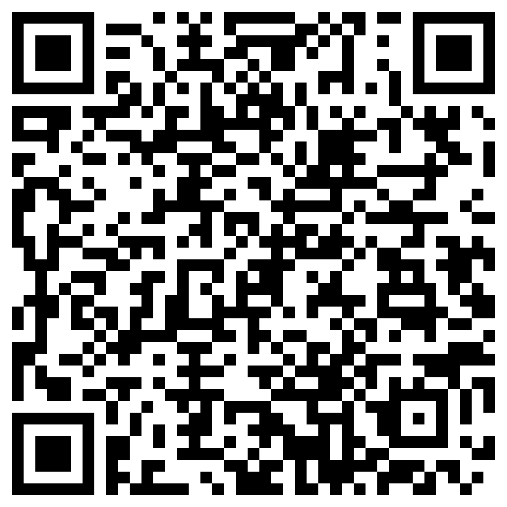

Welcome to the StreetPass 3.0 Shop!

Just place `StreetPass-Shop.unistore` and `StreetPass-Shop.t3x` (If you like Icons) to `sdmc:/3ds/Universal-Updater/stores/` and have fun with the shop.

Alternatively, you can also now use Universal-Updater v3's QR Code function, to download StreetPass-Shop.. without the need to take out the SD Card.. or do it over FTP!

### You will need a WiFi connection, to use this feature, so make sure you are connected to the internet!

Here are the instructions to do so:

1.) Access the Settings of Universal-Updater, by clicking on the settings icon of the sidebar (The last one).

2.) Go to `Select UniStore`.

3.) Press on the QR Code icon.. you should know, how it looks like.

NOTE: Scan this QR Code here: 

After you scanned it, Universal-Updater will download the UniStore + the Spritesheet.. from now on, Universal-Updater will handle the update of the UniStore for you, when there is an update available.

4.) Select `StreetPass-Shop.unistore` and press `A`. Now you can use StreetPass-Shop and have fun!!
